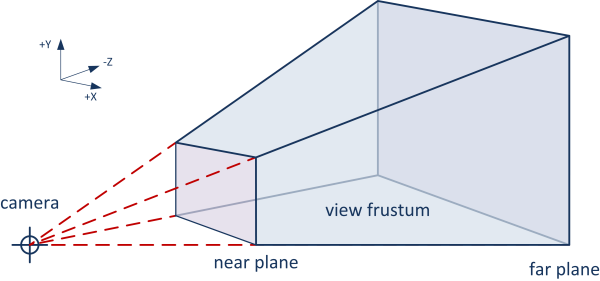

**cull?**

Cull: 불필요한 것을 제거 (사전적 의미: 도태시키다)

- Back-face culling
- Frustum culling
- Occlusion culling

**Frustum?**

Frustum은 잘린 피라미드 모양, 유식한 말로 '절두체' 를 의미.

3D 씬에서 카메라가 보는 영역은 사실 사각형이 아니라 잘린 피라미드 모양인데 이것을 'View Frustum' 이라고 부른다.

- FOV(Field of View, 시야각)에 따라 양옆으로 벌어짐.
  - 따라서 클수록 더 넓은 영역이 보이고 (=광각)
  - 작을수록 더 좁은 영역이 보인다.
